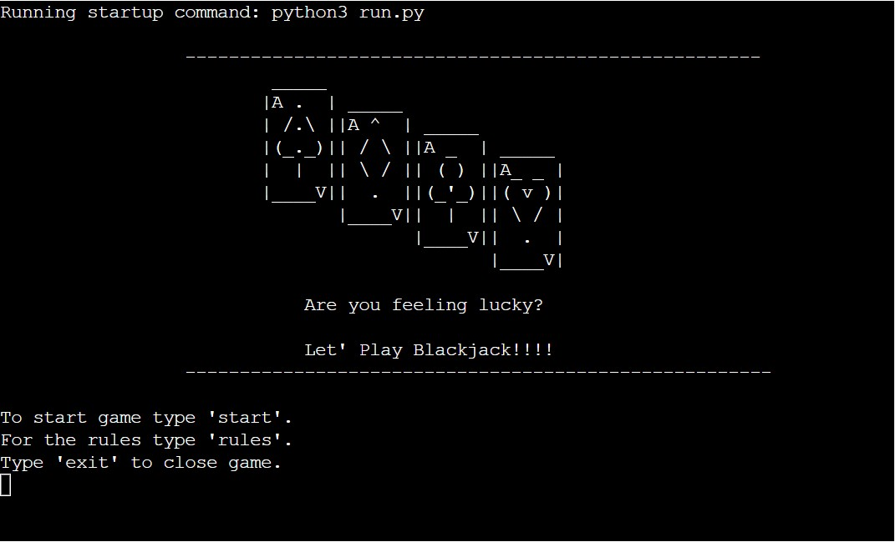
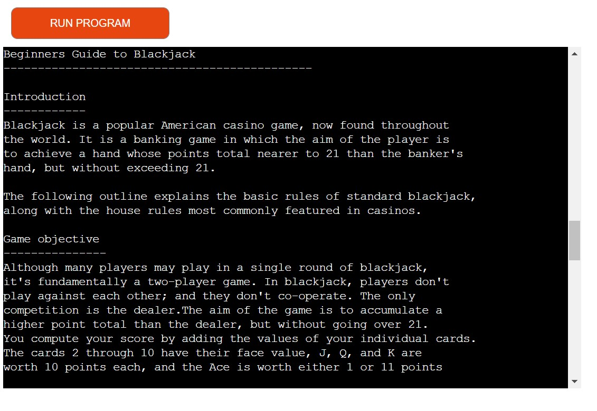
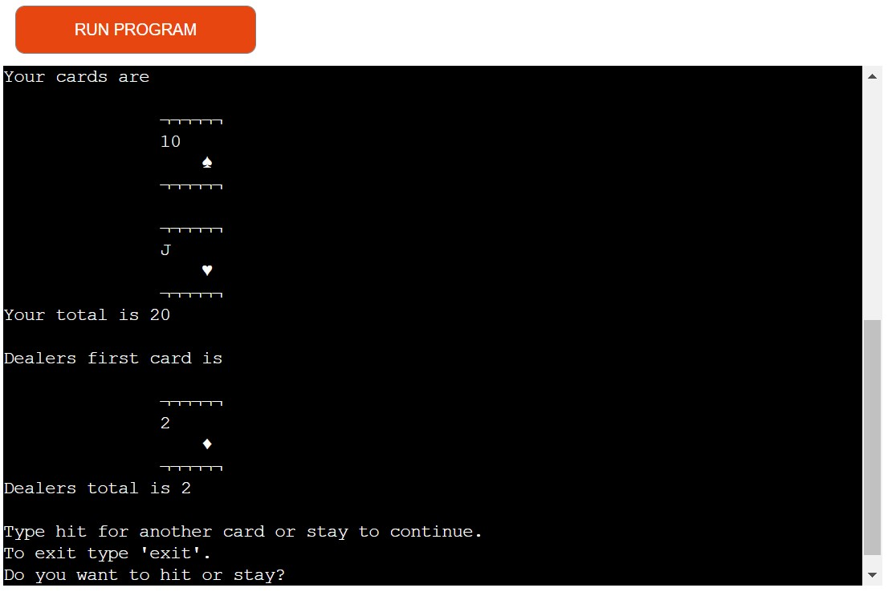
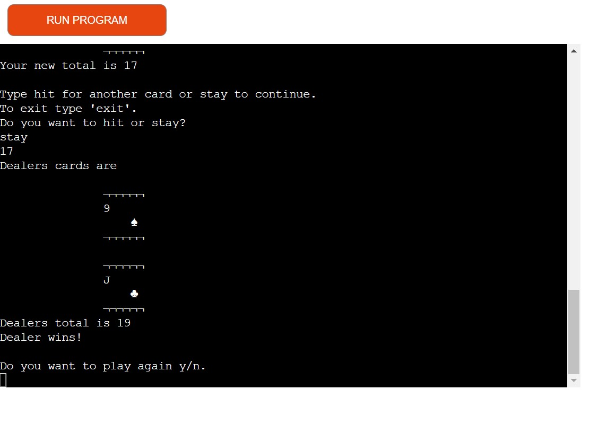
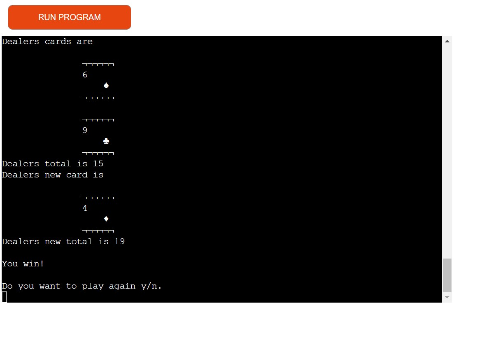
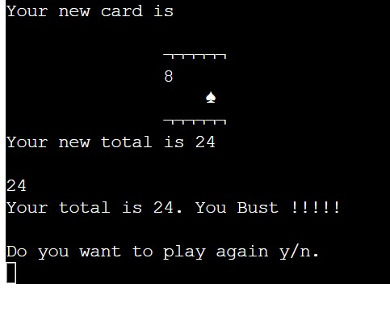
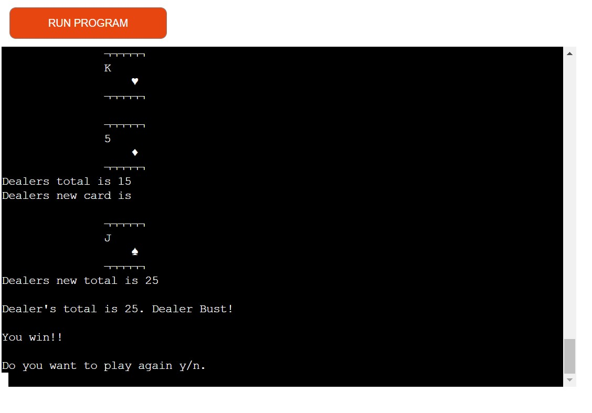
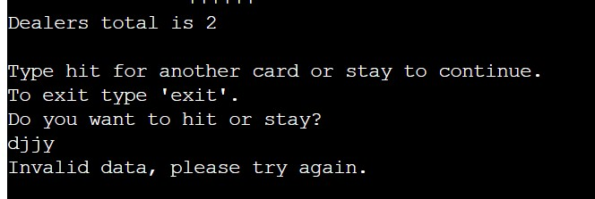
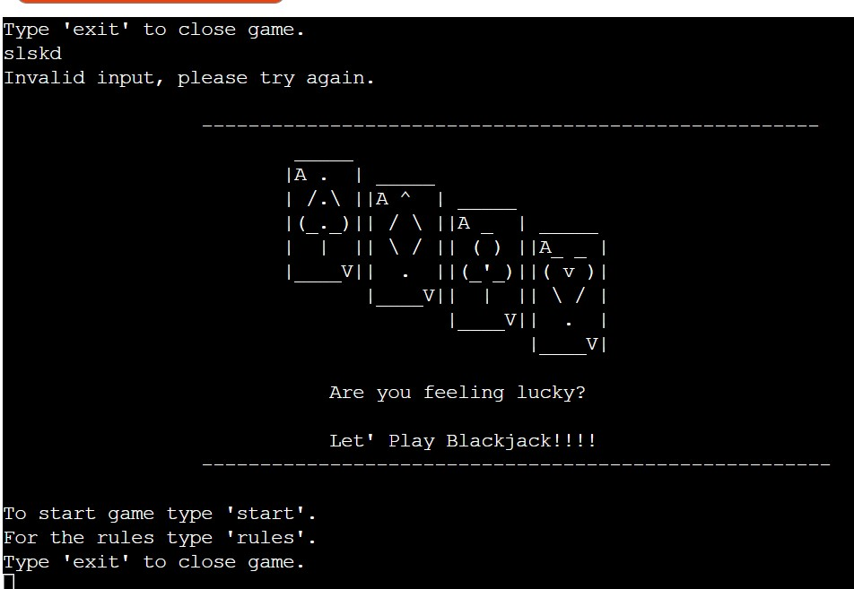
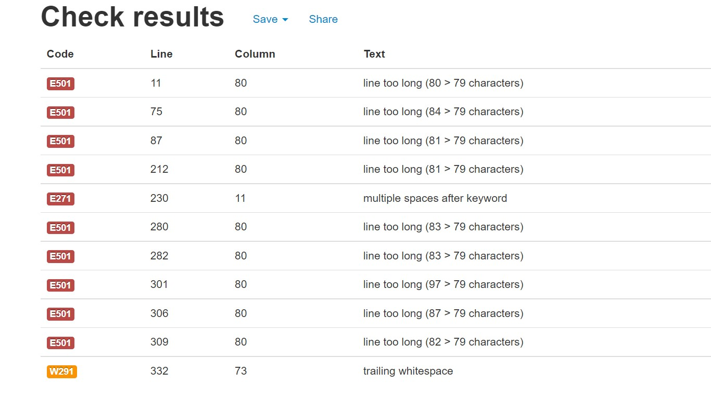

# Let's Play Blackjack !
------------------------
[View Live project here](http://lets-play-blackjack.herokuapp.com/)

[Code](https://github.com/louwJohan/lets-play-blackjack)

## Introduction
Display your Blackjack skills in Let's Play Blackjack and see if you can beat the 
dealer. Let's Play Blackjack is a command line application to play blackjack against
the computer for fun. Users can inter act with the programme deciding to 
choose another card or to continue. It cant also display the rules if you are new
to the game.

## Index 
- [User Stories](#user-stories)
- [Features](#features)
- [Testing](#testing)
- [Technology Used](#technology-used)
- [Deployment](#deployment)
- [Credits](#credits)

## User Stories
### As a user I want the site to be 
- Easy to navigate
- Easy to understand
- clear and simple instructions
- To exit at any time

## Features
### The landing page

The landing page displays a graphic of cards the games name and prompts.
It gives clear instructions. Do you want to play or do you want the rules or
to exit and allows for user input.

If the user inputs rules the rules of Blackjack will be displayed and how to play the game,
this will also display the landing page again so you do not have to restart the game.

If the player inputs start the game will start and the player will again be prompted for a response.
It the player types exit it will exit the game.

### Game play
During game play the player will be handed two cards and his total will be displayed. The player
will be prompted to make a response. Hit will hand the player another card and stay will 
continue the game

If the player types hit, a new card will be handed to the player and the new total will be 
calculated. If the player's new total is greater than 21 he will 'Bust' and lose and the game
will ask if he want to play again.

If the player chooses to stay the game continues. The dealers second card will be displayed 
and if the total is less than 17 he will be handed a new card until his total is 17 or more.
If the total of the dealer is greater than 21 he will 'Bust' and the player will automatically win.

When both the player and dealer's totals are between 17 and 21 it checks who the winner is .
The totals are compared and the highest score wins, if the scores are equal it is a tie.

### Validation
The player is prompted to input certain commands at the start and during game play.
The player's input is validated for every input and will display a error message if the 
wrong data is inputted. 

### Exit
The game has various ways to exit at the landing page when typing exit the programme will exit.
During game play you can also exit by and it will take you to the landing page and you can exit 
the programme from the landing page.

### Data Sets
Data is automatically created a deck of cards is generated with 52 cards. The cards are handed
out to the various players and added for the value they have. The values are compared and a winner
is determined.

## Testing 

The programme was tested by playing the game and assessing the outcomes, on the deployed project and while coding the Project.
- Check is main graphic displays
- Check is user commands display and programme allows for input
- Try different inputs to see if error message comes up
- When game starts see if cards display and totals are added correctly
- In game play check if error message come up when wrong input is typed in
- Make sure when 'hit' another cards is displayed and totals are added again.
- When stay dealers cards are dealt and totals are added up.
- Make sure game exits when exit is typed
- Check winner is correctly calculated by comparing scores

The code was run through the PEP8 online linter (PEP8 LINTER)[http://pep8online.com/]. There
are a few lines of code longer than 79 characters and one white space I could not remove

### Bugs
When playing the game if a face card expl. a Queen, King or Jack was the first card
and a Ace was the second it did not add the ace as 11. There was a mistake in the loop 
it ony checked if the first card was smaller than 10 and not smaller and equal. 
This was easily fix and the game worked perfectly

## Technology used
Python 3 was used for this programme and a template from The Code Institute to display the
programme in a web browser 

## Deployment

### How to clone the GitHub repository
Steps to create a local clone
- Go to the https://github.com/louwJohan/lets-play-blackjack repository on GitHub
- Click the "Code" button to the right of the screen, click HTTPs and copy the link there
- Open a GitBash terminal and navigate to the directory where you want to locate the clone
- On the command line, type "git clone" then paste in the copied url and press the Enter key to begin the clone process
- Changes made to the local clone can be pushed back to the repository using the following commands 
- git add filenames (or "." to add all changed files)
- git commit -m "text message describing changes"
- git push

The project was deployed on Heroku using the following steps
- Log onto your Heroku account
- Click on 'new' in the right hand corner and chose 'Create new app'
- This will redirect you to a new page
- Create a name for the app and choose your region and click create new app
- Go to settings and select reveal config vars
- input at key 'PORT' and at value '8000' and click on add
- click on add build pack and select Python and then Node and save changes
- click on deployment and scroll down to deployment method
- chose Github and search for the repository
- click on connect to connect repository
- then click on enable automatic deploys

## Credits
The rules for blackjack was used from the website [Official Game Rules](https://www.officialgamerules.org/)